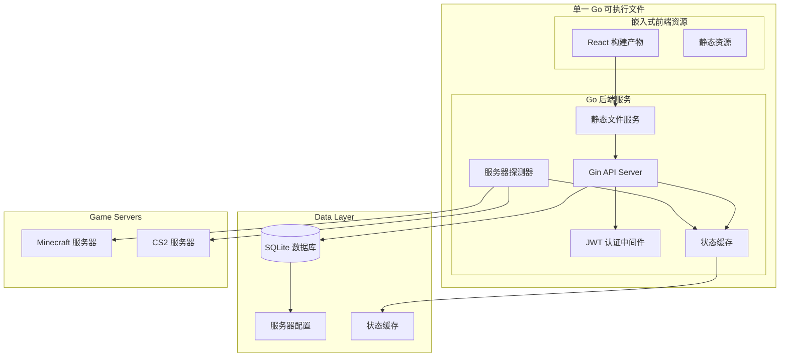

# Design Document: 游戏服务器监控面板

## Overview

游戏服务器监控面板是一个现代化的 Web 应用程序，用于实时监控 Minecraft 和 CS2 游戏服务器状态。系统采用前后端分离架构，后端使用 Go + Gin + SQLite 提供高性能的 API 服务和服务器探测功能，前端使用 React + Tailwind + Zustand 构建响应式用户界面。

核心特性包括：实时服务器状态监控、多协议支持（Minecraft Query 和 Source Query）、管理员后台、响应式设计和高性能缓存机制。

## Architecture

### 系统架构图



### 技术栈选择

**后端技术栈：**
- **Go 1.21+**: 高性能、并发友好的系统语言
- **Gin Framework**: 轻量级、高性能的 HTTP Web 框架
- **GORM + SQLite**: 简单易用的 ORM 和嵌入式数据库
- **JWT**: 无状态的身份认证机制
- **embed**: Go 1.16+ 的静态资源嵌入功能
- **协议库**: 
  - `github.com/xrjr/mcutils` - Minecraft 协议实现
  - `github.com/rumblefrog/go-a2s` - Source Query 协议实现

**前端技术栈：**
- **React 18**: 现代化的用户界面库
- **TypeScript**: 类型安全的 JavaScript 超集
- **Tailwind CSS**: 实用优先的 CSS 框架
- **Zustand**: 轻量级状态管理库
- **React Router**: 客户端路由管理
- **Axios**: HTTP 客户端库
- **Vite**: 快速的前端构建工具

**部署架构：**
- **单一可执行文件**: 前端构建产物嵌入到 Go 二进制文件中
- **静态资源服务**: Go 程序同时提供 API 和静态文件服务
- **数据库文件**: SQLite 数据库文件与可执行文件同目录

## Components and Interfaces

### 后端组件架构

#### 1. API 服务层 (API Layer)

```go
// 主要路由组
type Routes struct {
    Public  *gin.RouterGroup  // 公共接口
    Admin   *gin.RouterGroup  // 管理接口 (需要 JWT)
    Static  *gin.RouterGroup  // 静态文件服务
}

// 静态文件服务
GET  /*filepath                // 嵌入式前端资源服务 (SPA fallback)

// 公共接口
GET  /api/servers           // 获取所有服务器状态
GET  /api/servers/:id       // 获取特定服务器详情
POST /api/auth/login        // 管理员登录

// 管理接口 (需要 JWT 认证)
POST   /api/admin/servers     // 添加服务器
PUT    /api/admin/servers/:id // 更新服务器
DELETE /api/admin/servers/:id // 删除服务器
```

#### 静态资源嵌入

```go
//go:embed frontend/dist/*
var frontendFS embed.FS

// 静态文件服务器配置
func setupStaticRoutes(r *gin.Engine) {
    // 嵌入式文件系统
    staticFS, _ := fs.Sub(frontendFS, "frontend/dist")
    
    // 静态资源服务
    r.StaticFS("/assets", http.FS(staticFS))
    
    // SPA 路由支持 - 所有非 API 路由返回 index.html
    r.NoRoute(func(c *gin.Context) {
        if strings.HasPrefix(c.Request.URL.Path, "/api") {
            c.JSON(404, gin.H{"error": "API endpoint not found"})
            return
        }
        
        indexHTML, _ := frontendFS.ReadFile("frontend/dist/index.html")
        c.Data(200, "text/html; charset=utf-8", indexHTML)
    })
}

#### 2. 服务器探测器 (Server Prober)

```go
type ServerProber interface {
    ProbeMinecraft(address string, port int) (*ServerStatus, error)
    ProbeCS2(address string, port int) (*ServerStatus, error)
    StartPeriodicProbing(interval time.Duration)
    StopPeriodicProbing()
}

type ServerStatus struct {
    Online       bool      `json:"online"`
    Players      int       `json:"players"`
    MaxPlayers   int       `json:"max_players"`
    Version      string    `json:"version"`
    Ping         int64     `json:"ping"`        // 响应时间 (ms)
    LastUpdated  time.Time `json:"last_updated"`
}
```

#### 3. 缓存管理器 (Cache Manager)

```go
type CacheManager interface {
    SetServerStatus(serverID uint, status *ServerStatus)
    GetServerStatus(serverID uint) (*ServerStatus, bool)
    GetAllServerStatuses() map[uint]*ServerStatus
    ClearExpiredEntries()
}

// 使用内存缓存，避免频繁数据库查询
type MemoryCache struct {
    data   map[uint]*CachedStatus
    mutex  sync.RWMutex
    ttl    time.Duration
}
```

#### 4. 认证中间件 (Auth Middleware)

```go
type AuthMiddleware struct {
    secretKey []byte
}

func (a *AuthMiddleware) RequireAuth() gin.HandlerFunc {
    return func(c *gin.Context) {
        token := extractTokenFromHeader(c)
        if !a.validateJWT(token) {
            c.JSON(401, gin.H{"error": "Unauthorized"})
            c.Abort()
            return
        }
        c.Next()
    }
}
```

### 前端组件架构

#### 1. 状态管理 (Zustand Stores)

```typescript
// 服务器状态管理
interface ServerStore {
    servers: Server[]
    loading: boolean
    error: string | null
    
    // Actions
    fetchServers: () => Promise<void>
    refreshServerStatus: () => Promise<void>
    getServerById: (id: number) => Server | undefined
}

// 认证状态管理
interface AuthStore {
    isAuthenticated: boolean
    token: string | null
    
    // Actions
    login: (credentials: LoginCredentials) => Promise<boolean>
    logout: () => void
    checkAuthStatus: () => boolean
}

// 管理员状态管理
interface AdminStore {
    servers: Server[]
    
    // Actions
    addServer: (server: CreateServerRequest) => Promise<void>
    updateServer: (id: number, server: UpdateServerRequest) => Promise<void>
    deleteServer: (id: number) => Promise<void>
}
```

#### 2. 页面组件

```typescript
// 主页面组件
const HomePage: React.FC = () => {
    const { servers, loading, fetchServers } = useServerStore()
    
    useEffect(() => {
        fetchServers()
        const interval = setInterval(fetchServers, 30000) // 30秒刷新
        return () => clearInterval(interval)
    }, [])
    
    return (
        <div className="grid grid-cols-1 md:grid-cols-2 lg:grid-cols-3 gap-6">
            {servers.map(server => (
                <ServerCard key={server.id} server={server} />
            ))}
        </div>
    )
}

// 服务器卡片组件
const ServerCard: React.FC<{server: Server}> = ({ server }) => {
    return (
        <div className="bg-white rounded-lg shadow-md p-6 hover:shadow-lg transition-shadow">
            <ServerStatusIndicator status={server.status} />
            <h3 className="text-xl font-semibold">{server.name}</h3>
            <PlayerCountBar current={server.players} max={server.maxPlayers} />
            <PingIndicator ping={server.ping} />
        </div>
    )
}
```

## Data Models

### 数据库模型

```go
// 服务器配置模型
type Server struct {
    ID          uint      `gorm:"primaryKey" json:"id"`
    Name        string    `gorm:"not null" json:"name"`
    Type        string    `gorm:"not null" json:"type"`        // "minecraft" 或 "cs2"
    Address     string    `gorm:"not null" json:"address"`     // IP 或域名
    Port        int       `gorm:"not null" json:"port"`        // 游戏端口
    Description string    `json:"description"`                 // 服务器描述
    DownloadURL string    `json:"download_url"`                // 客户端下载链接
    Changelog   string    `gorm:"type:text" json:"changelog"`  // 更新日志 (Markdown)
    Version     string    `json:"version"`                     // 探测到的版本
    CreatedAt   time.Time `json:"created_at"`
    UpdatedAt   time.Time `json:"updated_at"`
}

// 管理员用户模型
type User struct {
    ID        uint      `gorm:"primaryKey" json:"id"`
    Username  string    `gorm:"unique;not null" json:"username"`
    Password  string    `gorm:"not null" json:"-"`              // 密码哈希，不返回给前端
    CreatedAt time.Time `json:"created_at"`
    UpdatedAt time.Time `json:"updated_at"`
}
```

### API 数据传输对象

```go
// 服务器状态响应
type ServerStatusResponse struct {
    Server
    Status ServerStatus `json:"status"`
}

// 服务器列表响应
type ServerListResponse struct {
    Servers []ServerStatusResponse `json:"servers"`
    Total   int                    `json:"total"`
}

// 创建服务器请求
type CreateServerRequest struct {
    Name        string `json:"name" binding:"required"`
    Type        string `json:"type" binding:"required,oneof=minecraft cs2"`
    Address     string `json:"address" binding:"required"`
    Port        int    `json:"port" binding:"required,min=1,max=65535"`
    Description string `json:"description"`
    DownloadURL string `json:"download_url"`
    Changelog   string `json:"changelog"`
}

// 登录请求和响应
type LoginRequest struct {
    Username string `json:"username" binding:"required"`
    Password string `json:"password" binding:"required"`
}

type LoginResponse struct {
    Token     string    `json:"token"`
    ExpiresAt time.Time `json:"expires_at"`
}
```

### 前端 TypeScript 类型

```typescript
// 服务器接口
interface Server {
    id: number
    name: string
    type: 'minecraft' | 'cs2'
    address: string
    port: number
    description: string
    download_url: string
    changelog: string
    version: string
    created_at: string
    updated_at: string
}

// 服务器状态接口
interface ServerStatus {
    online: boolean
    players: number
    max_players: number
    version: string
    ping: number
    last_updated: string
}

// 完整的服务器状态响应
interface ServerWithStatus extends Server {
    status: ServerStatus
}

// API 响应类型
interface ApiResponse<T> {
    data: T
    message?: string
    error?: string
}
```

## Correctness Properties

*属性是一个特征或行为，应该在系统的所有有效执行中保持为真——本质上，是关于系统应该做什么的正式声明。属性作为人类可读规范和机器可验证正确性保证之间的桥梁。*

基于需求分析，我需要使用 prework 工具来分析接受标准的可测试性：

基于需求分析，以下是系统的正确性属性：

### Property Reflection

在编写属性之前，我需要识别和消除冗余：

**识别的冗余：**
- 属性 1.3 和 1.4 (在线/离线状态指示器) 可以合并为一个综合的状态指示器属性
- 属性 3.1 和 3.2 (不同协议探测) 可以合并为一个通用的协议探测属性
- 属性 5.1, 5.3, 5.4 (CRUD操作) 可以合并为一个数据库操作一致性属性
- 属性 7.1 和 7.2 (响应式布局) 可以合并为一个响应式设计属性

**合并后的属性：**

### Property 1: 服务器列表完整性
*对于任何* 配置的服务器集合，主页面应该显示所有服务器及其完整信息（名称、类型、状态、玩家数）
**Validates: Requirements 1.1, 1.2**

### Property 2: 状态指示器一致性
*对于任何* 服务器状态，UI 应该显示与实际状态一致的颜色指示器（在线显示绿色，离线显示红色）
**Validates: Requirements 1.3, 1.4**

### Property 3: 自动刷新周期性
*对于任何* 运行中的系统，状态监控器应该按照配置的间隔（30秒）定期刷新服务器状态
**Validates: Requirements 1.5**

### Property 4: 导航一致性
*对于任何* 服务器卡片点击事件，系统应该导航到对应服务器的详情页面
**Validates: Requirements 2.1**

### Property 5: 详情页面完整性
*对于任何* 服务器详情页面，应该显示服务器的所有详细信息（描述、版本、更新日志）
**Validates: Requirements 2.2**

### Property 6: 条件渲染一致性
*对于任何* 有下载链接的服务器，详情页面应该显示下载按钮；没有下载链接的服务器不应该显示下载按钮
**Validates: Requirements 2.3**

### Property 7: Markdown 渲染正确性
*对于任何* 有效的 Markdown 文本，系统应该将其正确渲染为对应的 HTML 格式
**Validates: Requirements 2.4**

### Property 8: 协议探测正确性
*对于任何* 游戏服务器类型（Minecraft 或 CS2），探测器应该使用正确的协议并解析出玩家数量、最大玩家数、版本和响应时间
**Validates: Requirements 3.1, 3.2, 3.3**

### Property 9: 离线检测准确性
*对于任何* 无响应的服务器，探测器应该将其标记为离线状态
**Validates: Requirements 3.4**

### Property 10: 非阻塞探测
*对于任何* 用户请求，服务器探测任务不应该阻塞 API 响应
**Validates: Requirements 3.5**

### Property 11: 认证访问控制
*对于任何* 管理页面访问请求，系统应该要求有效的身份验证
**Validates: Requirements 4.1**

### Property 12: JWT 认证流程
*对于任何* 登录请求，正确的凭据应该生成有效的 JWT token，错误的凭据应该返回认证失败
**Validates: Requirements 4.2, 4.3**

### Property 13: Token 过期处理
*对于任何* 过期的 JWT token，系统应该拒绝访问并要求重新认证
**Validates: Requirements 4.4**

### Property 14: 管理接口保护
*对于任何* 管理 API 请求，系统应该验证 JWT token 的有效性
**Validates: Requirements 4.5**

### Property 15: 数据库操作一致性
*对于任何* 服务器配置的增删改操作，数据库中的数据应该与操作结果保持一致
**Validates: Requirements 5.1, 5.3, 5.4**

### Property 16: 输入验证完整性
*对于任何* 服务器配置请求，系统应该验证所有必需字段的存在和格式有效性
**Validates: Requirements 5.2, 5.5**

### Property 17: 数据持久化一致性
*对于任何* 系统重启，应该能够从数据库正确加载所有之前保存的服务器配置
**Validates: Requirements 6.1, 6.2, 6.3, 6.4**

### Property 18: 缓存机制有效性
*对于任何* 服务器状态请求，系统应该返回缓存的最新状态而不是实时探测
**Validates: Requirements 6.5, 8.2**

### Property 19: 响应式布局适应性
*对于任何* 屏幕尺寸，系统应该显示适当的布局（桌面多列，移动单列）
**Validates: Requirements 7.1, 7.2**

### Property 20: 状态可视化一致性
*对于任何* 服务器状态和玩家数据，系统应该使用直观的颜色指示器和图形化展示
**Validates: Requirements 7.3, 7.4**

### Property 21: 后台探测独立性
*对于任何* 探测失败的服务器，不应该影响其他服务器的监控和系统的整体运行
**Validates: Requirements 8.1, 8.5**

### Property 22: 探测间隔配置性
*对于任何* 配置的探测间隔，系统应该按照该间隔执行探测任务
**Validates: Requirements 8.4**

### Property 23: 状态更新及时性
*对于任何* 服务器状态变化，应该在下一个探测周期内被检测并更新
**Validates: Requirements 8.3**

## Error Handling

### 错误处理策略

**1. 网络错误处理**
- 服务器探测超时：设置合理的超时时间（5秒），超时后标记为离线
- 连接失败：记录错误日志，标记服务器为离线状态
- 协议解析错误：记录详细错误信息，返回默认的离线状态

**2. 数据库错误处理**
- 连接失败：系统启动时重试连接，失败则退出
- 查询错误：记录错误日志，返回空结果或默认值
- 写入失败：回滚事务，向用户返回错误信息

**3. 认证错误处理**
- JWT 解析失败：返回 401 未授权错误
- Token 过期：返回 401 错误，前端重定向到登录页
- 权限不足：返回 403 禁止访问错误

**4. 输入验证错误**
- 必需字段缺失：返回 400 错误和详细的验证信息
- 格式错误：返回 400 错误和格式要求说明
- 数据类型错误：返回 400 错误和类型转换失败信息

**5. 前端错误处理**
- API 请求失败：显示用户友好的错误消息
- 网络连接问题：显示重试按钮
- 数据加载失败：显示加载失败状态和重新加载选项

### 错误恢复机制

```go
// 探测器错误恢复
func (p *ServerProber) probeWithRetry(server *Server) *ServerStatus {
    for attempt := 0; attempt < 3; attempt++ {
        status, err := p.probe(server)
        if err == nil {
            return status
        }
        
        log.Printf("Probe attempt %d failed for server %s: %v", 
                   attempt+1, server.Name, err)
        
        if attempt < 2 {
            time.Sleep(time.Second * time.Duration(attempt+1))
        }
    }
    
    return &ServerStatus{Online: false, LastUpdated: time.Now()}
}
```

## Testing Strategy

### 双重测试方法

系统将采用单元测试和基于属性的测试相结合的方法：

**单元测试职责：**
- 验证特定示例和边界情况
- 测试组件集成点
- 验证错误条件处理
- 测试 UI 组件的特定交互

**基于属性的测试职责：**
- 验证跨所有输入的通用属性
- 通过随机化实现全面的输入覆盖
- 验证系统的正确性属性

### 测试技术栈

**后端测试：**
- **Go 测试框架**: 标准库 `testing` 包
- **属性测试库**: `github.com/leanovate/gopter` 
- **数据库测试**: 内存 SQLite 数据库
- **HTTP 测试**: `httptest` 包用于 API 测试

**前端测试：**
- **单元测试**: Jest + React Testing Library
- **属性测试**: `fast-check` 库
- **组件测试**: 渲染测试和交互测试
- **集成测试**: 端到端用户流程测试

### 属性测试配置

每个属性测试必须：
- 运行最少 100 次迭代（由于随机化）
- 引用其设计文档属性
- 使用标签格式：**Feature: game-server-monitor, Property {number}: {property_text}**

### 测试数据生成策略

**智能生成器设计：**
- **服务器配置生成器**: 生成有效的 IP 地址、端口范围、游戏类型
- **状态数据生成器**: 生成合理的玩家数量、响应时间、版本字符串
- **网络响应生成器**: 模拟各种协议响应格式
- **UI 状态生成器**: 生成各种屏幕尺寸和设备类型

### 测试覆盖目标

- **后端代码覆盖率**: 目标 85%+
- **前端组件覆盖率**: 目标 80%+
- **API 端点覆盖率**: 100%
- **错误路径覆盖率**: 目标 90%+

### 持续集成测试

```yaml
# GitHub Actions 示例配置
name: Test Suite
on: [push, pull_request]
jobs:
  backend-tests:
    runs-on: ubuntu-latest
    steps:
      - uses: actions/checkout@v3
      - uses: actions/setup-go@v3
        with:
          go-version: '1.21'
      - run: go test -v -race -coverprofile=coverage.out ./...
      - run: go tool cover -html=coverage.out -o coverage.html
  
  frontend-tests:
    runs-on: ubuntu-latest
    steps:
      - uses: actions/checkout@v3
      - uses: actions/setup-node@v3
        with:
          node-version: '18'
      - run: npm ci
      - run: npm run test:coverage
      - run: npm run test:properties
```

这个设计为游戏服务器监控面板提供了完整的技术架构，包括详细的组件设计、数据模型、正确性属性和全面的测试策略。系统采用现代化的技术栈，确保高性能、可维护性和用户体验。